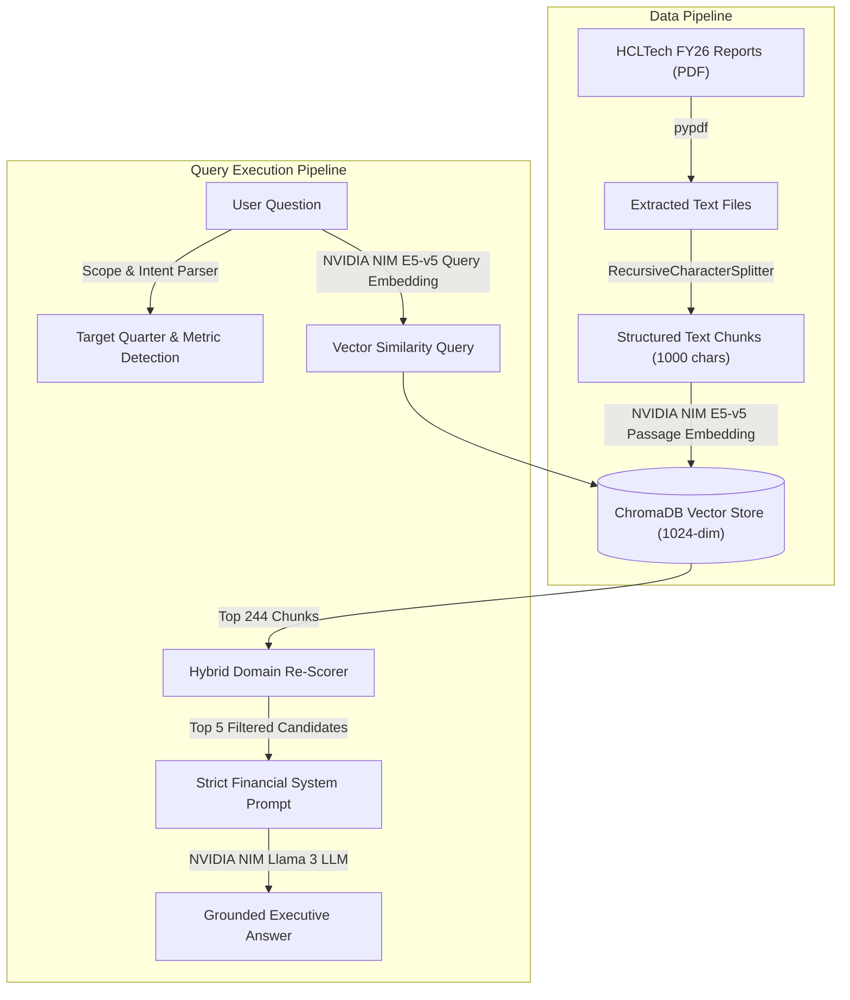

# 📊 HCLTech Financial RAG Intelligence

An enterprise-grade Retrieval-Augmented Generation (RAG) system built to parse, index, and query **HCLTech's FY26 quarterly financial reports (Q1–Q4)**.

Powered by **NVIDIA NIM (NVIDIA API Catalog)** microservices (`nvidia/nv-embedqa-e5-v5` embeddings and `meta/llama-3.1-8b-instruct` / `meta/llama-3.3-70b-instruct`), **ChromaDB**, and **Streamlit**.

---

## 🎯 Executive Overview

This application provides financial analysts, executives, and stakeholders with grounded, instant, and zero-hallucination answers regarding HCLTech's quarterly performance metrics:
- **Revenue** (QoQ / YoY growth)
- **EBIT & Operating Margins**
- **Net Income & Profitability Metrics**
- **Segmental & Quarterly Financial Highlights**

Unlike generic LLMs that tend to hallucinate or average out annual numbers when asked quarter-specific questions, this system enforces **strict financial domain guardrails** and **hybrid heuristic re-ranking** to return exact figures directly from authoritative filings.

---

## 🖥️ Interactive Dashboard Preview


> **Key Dashboard Features:**
> - **Model Selector**: Switch between ultra-fast inference (`llama-3.1-8b`, ~1.5s) and deep reasoning (`llama-3.3-70b`, ~15s).
> - **Preset Query Chips**: One-click sample financial queries for Q1-Q4.
> - **Pipeline Status Summary**: Live latency, scope detection, and vector search timing.
> - **Source Document Inspector**: Expandable cards displaying exact report source text, chunk IDs, and similarity scores.

---

## 🏗️ System Architecture



---

## ⚡ Core Technical Features & Guardrails

1. **Enterprise AI via NVIDIA NIM**:
   - Uses `nvidia/nv-embedqa-e5-v5` for query and passage vector embeddings.
   - Leverages `meta/llama-3.1-8b-instruct` and `meta/llama-3.3-70b-instruct` for context-grounded completion.
2. **Hybrid Domain Re-Ranking**:
   - Applies domain-specific keyword bonuses (e.g. `"inr revenue of"`, `"ebit at"`, `"ni at"`) combined with vector distance scores.
   - Penalizes annual-only figures when answering quarter-specific queries to prevent cross-quarter confusion.
3. **0% Math Hallucination Guardrail**:
   - Strict system prompt rules prohibit LLM figure calculation or dividing annual totals by 4. Answers are 100% cited and grounded.

---

## 📂 Project Directory Structure

```text
Finance-RAG-main/
├── app.py                  # Streamlit Dashboard UI & Session State Logic
├── requirements.txt        # Project Python Dependencies
├── .env                    # Environment Config (NVIDIA_API_KEY)
├── data/                   # Financial PDF Reports & Extracted Text
│   ├── HCLTech_Q1_FY26.pdf
│   ├── HCLTech_Q2_FY26.pdf
│   ├── HCLTech_Q3_FY26.pdf
│   ├── HCLTech_Q4_FY26.pdf
│   └── chunks.txt          # Consolidated Chunk Data
├── src/                    # Core RAG Modules
│   ├── extract_text.py     # PDF Text Extraction Script
│   ├── chunk_text.py       # Text Chunking Utility
│   ├── create_vector_db.py # Batched ChromaDB Indexing Script
│   ├── nvidia_client.py    # Centralized NVIDIA NIM API Client
│   └── rag.py              # Hybrid Retrieval, Scoring & LLM Synthesis
└── docs/                   # Documentation Assets & Screenshots
```

---

## 🚀 Quick Start Guide

### 1. Prerequisites
- Python 3.10+ installed
- An active **NVIDIA NIM API Key** (from NVIDIA Build / API Catalog)

### 2. Installation & Setup

1. **Clone the repository:**
   ```bash
   git clone https://github.com/your-username/Finance-RAG.git
   cd Finance-RAG
   ```

2. **Install Python dependencies:**
   ```bash
   pip install -r requirements.txt
   ```

3. **Configure Environment Variables:**
   Create a `.env` file in the root directory:
   ```env
   NVIDIA_API_KEY=nvapi-your-nvidia-nim-api-key-here
   ```

### 3. Ingestion & Indexing Pipeline

Run the data pipeline scripts to extract text, create chunks, and generate the vector index:

```bash
# Step 1: Extract text from financial PDFs
python src/extract_text.py

# Step 2: Split text into structured chunks
python src/chunk_text.py

# Step 3: Embed & store vectors in ChromaDB (Batched via NVIDIA NIM)
python src/create_vector_db.py
```

### 4. Launch the Dashboard

Start the Streamlit application:
```bash
streamlit run app.py
```
Open your browser at `http://localhost:8501`.

---

## 📊 Sample Benchmark Queries & Results

| Question | Answer Summary | Primary Source |
| :--- | :--- | :--- |
| **"What was HCLTech's revenue in Q4 FY26?"** | INR Revenue of **₹33,981 Crores**, up 0.3% QoQ & up 12.3% YoY. | `HCLTech_Q4_FY26.txt` (Chunk 6) |
| **"What was the Net Income in Q1 FY26?"** | Net Income (NI) at **₹3,843 Crores**. | `HCLTech_Q1_FY26.txt` (Chunk 4) |
| **"What was EBIT in Q2 FY26?"** | INR EBIT at **₹5,550 Crores**, up 12.3% QoQ & up 3.5% YoY. | `HCLTech_Q2_FY26.txt` (Chunk 4) |

---

## 🛠️ Built With
- [Streamlit](https://streamlit.io/) — Dashboard Web Application
- [NVIDIA NIM](https://build.nvidia.com/) — Enterprise AI Microservices & Models
- [ChromaDB](https://www.trychroma.com/) — Open-source Embeddings Database
- [pypdf](https://pypdf.readthedocs.io/) & [LangChain](https://www.langchain.com/) — Document Parsing & Chunking
